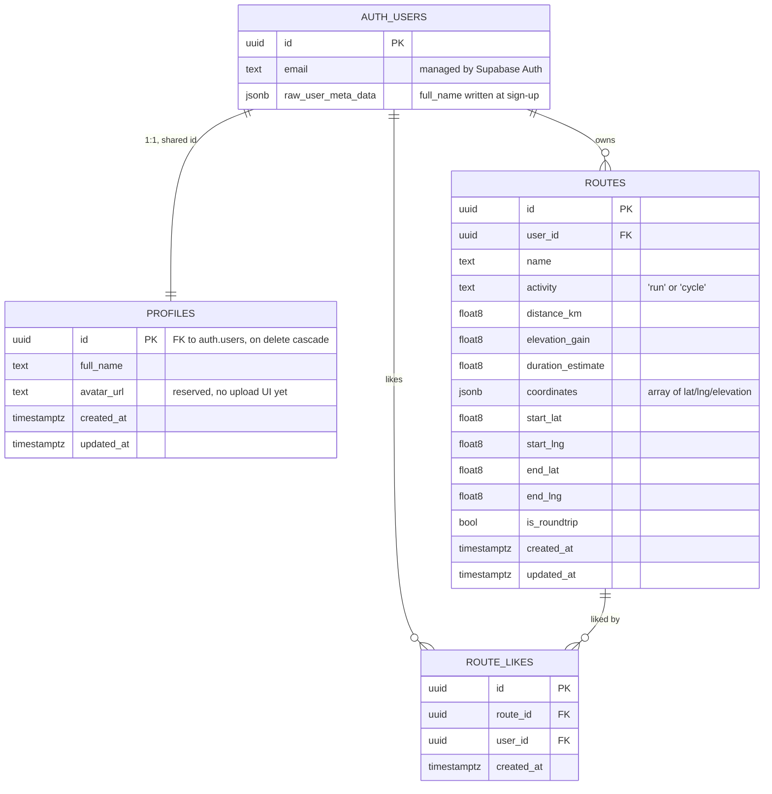

# Database

Routly runs on Supabase (Postgres + Auth). The schema is small — three tables
and one function — but the access rules matter more than usual, because the
browser and the Expo app talk to Postgres directly. There is no trusted
backend in between, so Row Level Security _is_ the authorisation layer.

The canonical definition lives in
[`supabase/migrations/20260827120000_init.sql`](../supabase/migrations/20260827120000_init.sql).
That file is the source of truth; this page explains it. To create the schema,
see [SETUP.md](./SETUP.md#4-set-up-the-database).

## Shape



`auth.users` is Supabase's own table. You never create or migrate it, and
application code cannot query it directly — that is the whole reason
`profiles` exists.

## Tables

### `profiles`

The public half of a user. Supabase keeps email, password hash and
confirmation state in `auth.users`, which is off-limits to the client;
anything Routly wants to store about a person goes here instead.

The primary key **is** the `auth.users` id rather than a fresh uuid. That
keeps the relationship 1:1 without a separate unique constraint, makes
`profiles` joinable to any `user_id` column, and means deleting an account
cascades the profile away with it.

| Column       | Type          | Notes                                                                    |
| ------------ | ------------- | ------------------------------------------------------------------------ |
| `id`         | `uuid` PK     | References `auth.users(id)`, `on delete cascade`                         |
| `full_name`  | `text`        | Also mirrored into auth user metadata at sign-up                         |
| `avatar_url` | `text`        | Read and written by the settings form, but no upload UI ships yet        |
| `created_at` | `timestamptz` | Defaults to `now()`                                                      |
| `updated_at` | `timestamptz` | Defaults to `now()`; not auto-updated, see [Known issues](#known-issues) |

Written by `handleSignUp()` in
[`packages/lib/supabase/auth.ts`](../packages/lib/supabase/auth.ts) and read
and updated by
[`useProfileSettings.ts`](../packages/lib/hooks/useProfileSettings.ts).

Note that `full_name` is stored in **two** places: this column, and the auth
user's metadata (`options.data.full_name` at sign-up). `updateProfile()`
writes both. The column is what the app reads.

### `routes`

A generated route the user chose to save.

The geometry is `jsonb`, not PostGIS `geography`. That is deliberate: Routly
never asks the database a geometric question — it fetches a route and replays
the line on a map — so adding a spatial extension would buy nothing and cost
every contributor a heavier local setup. The one location-based query that
does exist needs only the start point, which is why `start_lat` / `start_lng`
are ordinary columns alongside the blob.

| Column                   | Type          | Notes                                                                                               |
| ------------------------ | ------------- | --------------------------------------------------------------------------------------------------- |
| `id`                     | `uuid` PK     | `gen_random_uuid()`                                                                                 |
| `user_id`                | `uuid`        | References `auth.users(id)`, `on delete cascade`                                                    |
| `name`                   | `text`        | Defaults to `'Untitled route'`                                                                      |
| `activity`               | `text`        | Stored as `'run'` or `'cycle'` — see [Known issues](#known-issues)                                  |
| `distance_km`            | `float8`      | Kilometres, from the ORS response                                                                   |
| `elevation_gain`         | `float8`      | Total ascent in metres, computed client-side by `calculateTotalAscent()` rather than taken from ORS |
| `duration_estimate`      | `float8`      | ORS estimated duration in minutes                                                                   |
| `coordinates`            | `jsonb`       | Ordered `{lat, lng, elevation}[]`. Elevation in metres, `0` when ORS returned none                  |
| `start_lat`, `start_lng` | `float8`      | First coordinate, duplicated out for querying                                                       |
| `end_lat`, `end_lng`     | `float8`      | Equals start for roundtrips                                                                         |
| `is_roundtrip`           | `boolean`     | Defaults to `false`                                                                                 |
| `created_at`             | `timestamptz` | Defaults to `now()`                                                                                 |
| `updated_at`             | `timestamptz` | Set explicitly by `renameRoute()`                                                                   |

Indexed on `(created_at desc)` for Explore and `(user_id, created_at desc)`
for the profile list — the only two orderings the app asks for.

**The `coordinates` round-trip is worth understanding**, because it is the one
place where the storage format differs from the wire format. ORS and GeoJSON
use `[lng, lat, elevation]` arrays; the column stores `{lat, lng, elevation}`
objects. `saveRoute()` converts on the way in and the route detail pages
convert back on the way out:

```ts
// in  — useRouteActions.ts
coords.map(([lng, lat, elevation]) => ({
  lat,
  lng,
  elevation: elevation ?? 0,
}));

// out — apps/web/src/app/routes/[id]/page.tsx
route.coordinates.map((p) =>
  p.elevation != null ? [p.lng, p.lat, p.elevation] : [p.lng, p.lat],
);
```

If you add a feature that writes routes, go through `saveRoute()` rather than
inserting directly, or you will store arrays where the rest of the app expects
objects.

### `route_likes`

Join table for the liked-routes filter on Explore. A user can like a route
once, enforced by a unique index on `(route_id, user_id)`.

| Column       | Type          | Notes                                               |
| ------------ | ------------- | --------------------------------------------------- |
| `id`         | `uuid` PK     | `gen_random_uuid()`                                 |
| `route_id`   | `uuid`        | References `public.routes(id)`, `on delete cascade` |
| `user_id`    | `uuid`        | References `auth.users(id)`, `on delete cascade`    |
| `created_at` | `timestamptz` | Defaults to `now()`                                 |

Uniqueness is declared as a unique **index** rather than a table constraint
because `alter table ... add constraint if not exists` is not valid Postgres,
and the migration has to stay re-runnable.

## Row Level Security

Every table has RLS enabled. This is not optional hardening — it is the only
thing standing between the publishable key shipped in the client bundle and
your data. **If you disable RLS, the anon key becomes a full read/write key to
your database.**

| Table         | Select                             | Insert                 | Update     | Delete     |
| ------------- | ---------------------------------- | ---------------------- | ---------- | ---------- |
| `profiles`    | owner only                         | `auth.uid() = id`      | owner only | —          |
| `routes`      | **everyone, including signed-out** | `auth.uid() = user_id` | owner only | owner only |
| `route_likes` | owner only                         | `auth.uid() = user_id` | —          | owner only |

Three of these are worth explaining:

**`routes` is world-readable on purpose.** `/explore` is listed in
`PUBLIC_PATHS` in
[`packages/lib/config/routes.ts`](../packages/lib/config/routes.ts), so a
signed-out visitor must be able to browse other people's routes. The select
policy is therefore `using (true)` with no role restriction, which covers
`anon` as well as `authenticated`.

**The `profiles` insert policy is what makes sign-up work.** `handleSignUp()`
creates the profile row _from the client_ immediately after `signUp()`
returns, so a brand-new user has to be allowed to insert exactly one row keyed
to their own id. There is no database trigger doing this. See
[Known issues](#known-issues) for the consequence.

**The `routes` delete policy is load-bearing.** `deleteRoute()` in
[`useRouteActions.ts`](../packages/lib/hooks/useRouteActions.ts) issues
`delete().eq("id", id)` with no `user_id` filter:

```ts
const { error } = await supabase.from("routes").delete().eq("id", id);
```

The only thing preventing one user from deleting another user's route is the
policy's `using (auth.uid() = user_id)` clause. Postgres silently filters the
delete to rows the caller owns, so the call succeeds and deletes nothing.
Keep this in mind if you ever refactor these policies.

There is no `profiles` delete policy and no `route_likes` update policy,
because nothing in the app performs those operations. Absent policy means
denied.

## Functions

### `routes_near_me(lat, lng, radius_km default 50)`

Backs the "Near me" filter on Explore. Returns `setof routes`, ordered by
great-circle distance from the given point to each route's `start_lat` /
`start_lng`, within `radius_km`.

```ts
const { data, error } = await supabase.rpc("routes_near_me", {
  lat: userPos.lat,
  lng: userPos.lng,
});
```

The argument names are part of the API — `supabase.rpc()` passes named
parameters, so renaming `lat` or `lng` in SQL breaks the call site in
[`useExploreRoutes.ts`](../packages/lib/hooks/useExploreRoutes.ts) and its
`.native.ts` twin.

Distance is plain haversine, no PostGIS, consistent with the `jsonb` decision
above. Two details in the implementation:

- The `least(1, greatest(-1, ...))` clamp guards `acos()` against
  floating-point drift past ±1, which would otherwise raise `input is out of
range` when a route start point is compared against itself.
- `security invoker` means the function runs as the caller, so the RLS
  policies still apply to its results. A `security definer` function would
  bypass them.

The hook re-sorts the results client-side by distance as well, so the SQL
ordering is belt-and-braces rather than strictly required.

## Known issues

These are real defects in the current code, not setup mistakes. They are
documented here so a contributor does not spend an afternoon rediscovering
them — and they are reasonable first pull requests.

**The activity filter on Explore never matches anything.** Routes are saved
with `activity` set to `'run'` or `'cycle'` (from `ActivitySelect`, via
`RouteGenerationContext`), but the Explore filter compares against
`'running'` and `'cycling'`:

```ts
// FilterBar.tsx sets "running" / "cycling"
// useExploreRoutes.ts then does:
list = list.filter((r) => r.activity === activity);
```

Strict equality against a value that is never stored, so selecting Running or
Cycling on Explore returns zero routes. `formatActivityLabel()` in
`packages/lib/utils/activityText.ts` already normalises both spellings for
display, which is why the bug is invisible on route cards. Fixing it means
picking one vocabulary and using it in both places.

**Sign-up breaks if email confirmation is enabled.** Because the profile row
is inserted client-side, the insert needs an authenticated session. With
Supabase's default "Confirm email" setting on, `signUp()` returns a user but
**no session**, so the insert is rejected by RLS and `handleSignUp()` throws —
leaving an account in `auth.users` with no matching profile. Turn email
confirmation off for local development (see
[SETUP.md](./SETUP.md#4-set-up-the-database)), or move profile creation into a
database trigger on `auth.users`, which is the more robust fix and would also
let you drop the client-side insert.

**`updated_at` is not maintained by the database.** Both tables default it to
`now()` on insert, and `renameRoute()` sets it explicitly, but any other
update leaves it stale. A `before update` trigger would fix it in one place.

**`activity` has no CHECK constraint.** The allowed values are documented via
`comment on column` instead, so that applying this schema to a database with
existing rows cannot fail. If you resolve the vocabulary bug above, adding a
constraint becomes worthwhile.
